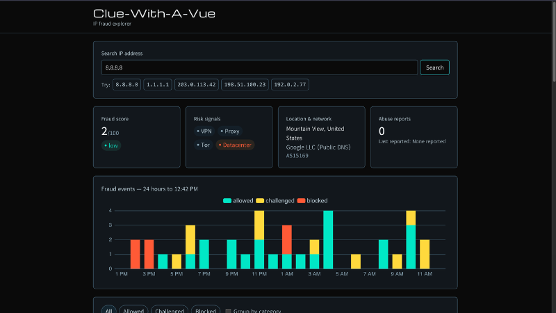

# Clue-With-A-Vue

A fraud analyst dashboard in Vue with TypeScript and Tailwind, featuring vue-echarts. Focus on secure frontend architecture, and responsive, accessible data-heavy UI. Everything is mocked client-side, including backend-related cross-checks and error states.

**Live demo:** [clue-with-a-vue.vercel.app](https://clue-with-a-vue.vercel.app/)



## Setup

```bash
npm install
npm run dev
```

Open the printed local URL and search an IP (try one of the quick picks for preset high/low risk, or any valid-format IPv4 address for a seeded return).

See [DECISIONS.md](./DECISIONS.md) for structural reasoning.
See [SECURITY.md](./SECURITY.md) for the security patterns applied.

## Scripts

| `npm run dev` | Start the Vite dev server |
| `npm run build` | Typecheck (`vue-tsc`) and production build |
| `npm run preview` | Serve the production build locally |
| `npm test` | Run Vitest once (fraud-events transforms) |
| `npm run test:watch` | Vitest in watch mode |
| `npm run lint` | ESLint (Vue + TypeScript) |
| `npm run format` | Prettier write across the repo |

Unit tests live next to the code they cover (e.g. `src/domains/fraud-events/transforms.test.ts`).

## How to extend

**Add a new fraud signal** (e.g. `isKnownBotnet: boolean`): add the field to
`IPAnalysisResult` in `domains/ip-analysis/types.ts`, add it to
`ipAnalysisSchema` in `services.ts`, populate it in `generateIPAnalysis()` in
`config/mock-data.ts`, then surface it in `IPSummaryCards.vue` (it already
maps a `signals` array to badges — add an entry there).

**Location:** analysis owns `city` + `country`; event `geolocation` is formatted
from those fields (one IP → one place), matching a typical GeoIP + events API.

## FYI

- No virtual scrolling in the table (see [DECISIONS.md](./DECISIONS.md)).
- Nothing is persisted between refreshes — no localStorage (see
  [SECURITY.md](./SECURITY.md)).
- Mock data is seeded per IP (timestamps use `asOf`) — see
  [DECISIONS.md](./DECISIONS.md).
- IPv4 only; IPv6 input is rejected with the same validation message.

## Credit

Designed and developed by Heather Hugo 2026, tooled using VC Code and AI (Chat, Claude, Cursor)